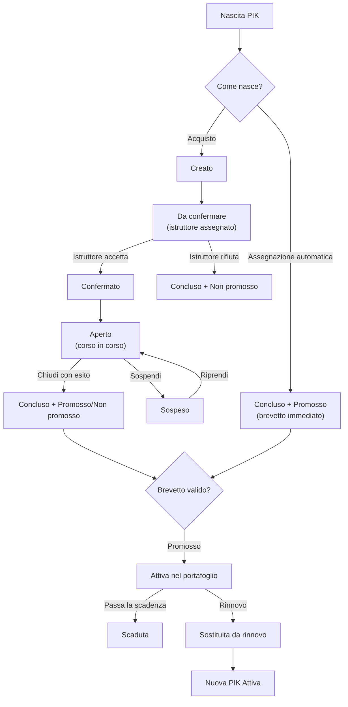
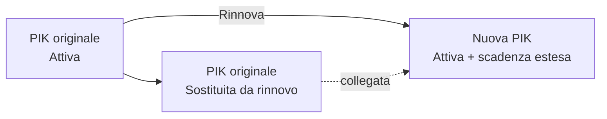

Questa pagina spiega **l'intero percorso** di una PIK Card nel sistema: come nasce, come avanza durante il corso, quando diventa un brevetto valido, cosa succede alla scadenza e come si rinnova.

Se cerchi solo le istruzioni operative, vai direttamente alle guide:

<CardGroup cols={2}>
  <Card title="Emettere una PIK" icon="plus" href="/guide/emettere-pik" />
  <Card title="Iscrizione e corso" icon="graduation-cap" href="/guide/iscrizione-e-corso" />
  <Card title="Rinnovare una PIK" icon="rotate" href="/guide/rinnovare-pik" />
  <Card title="Cos'è una PIK" icon="id-card" href="/concetti/pik-card" />
</CardGroup>

## Come leggere lo stato di una PIK

Una PIK non ha un solo stato, ma **quattro informazioni indipendenti** che vanno lette insieme. È la cosa più importante da capire: una carta può essere "conclusa" (corso finito) e allo stesso tempo "attiva" (brevetto valido).

| Informazione | Domanda a cui risponde | Valori |
|--------------|------------------------|--------|
| **Stato del corso** | A che punto è il percorso didattico? | Creato · Da confermare · Confermato · Aperto · Sospeso · Concluso |
| **Stato operativo** | Il brevetto è valido nel portafoglio? | Attiva · Scaduta · Sostituita da rinnovo · (Archiviata) |
| **Origine** | Come è nata la PIK? | Acquistata · Assegnazione automatica |
| **Esito** | Com'è andato l'esame? (solo a corso concluso) | Promosso · Non promosso |

<Note>
  La **stampa** del certificato fisico non è uno stato: è un'informazione a parte ("stampato il / da chi"). Una PIK può essere un brevetto valido anche se non è ancora stata stampata.
</Note>

<Note>
  **Archiviata** è uno stato riservato per casi eccezionali (uso manuale): una PIK archiviata è considerata **non più valida** e compare nell'elenco **"Scaduti & sostituiti"** insieme alle scadute e alle sostituite da rinnovo, non tra le attive.
</Note>

## Il flusso completo

## Fase 1 — Come nasce una PIK

Ci sono **due modi** in cui una PIK entra nel sistema.

### A. Acquisto (percorso normale)

La segreteria (o chi ha il permesso) **emette** una PIK collegando allievo, corso ed eventuale istruttore/struttura. La carta nasce in stato **Creato** e riceve subito un **numero univoco**.

Vedi la guida: [Emettere una PIK](/guide/emettere-pik).

### B. Assegnazione automatica (brevetto già acquisito)

Quando si registra un brevetto già posseduto o si sbloccano i **prerequisiti** di un corso, il sistema può creare PIK **automatiche**. Queste **saltano** tutto il workflow didattico: nascono già **Concluse**, **Promosse** e **Attive**, con data e certificato coerenti.

Succede tipicamente con l'azione **"Aggiungi carta"** dalla scheda utente: quando assegni un corso, il sistema calcola l'**albero dei prerequisiti** e crea automaticamente le PIK per i corsi propedeutici mancanti.

<Tip>
  Riconosci l'origine dalla colonna/filtro **Origine**: **Acquistata** segue il flusso completo, **Assegnazione automatica** è già un brevetto valido.
</Tip>

## Fase 2 — Il corso (solo PIK acquistate)

Questo è il cuore del percorso didattico. Ogni passaggio ha un responsabile e, di solito, un'email automatica.

| Passaggio | Chi lo fa | Da → A (stato corso) | Email |
|-----------|-----------|----------------------|-------|
| Emissione | Segreteria | — → **Creato** | Creazione PIK |
| Richiesta iscrizione | Segreteria/sistema | Creato → **Da confermare** | Richiesta iscrizione istruttore |
| Accetta | Istruttore/Admin | Da confermare → **Confermato** | Conferma iscrizione |
| Rifiuta | Istruttore | Da confermare → **Concluso** (Non promosso) | Rifiuto iscrizione |
| Apri corso | Istruttore/Admin | Confermato → **Aperto** | Apertura corso |
| Sospendi | Istruttore/Admin | Aperto → **Sospeso** | Corso sospeso |
| Riprendi | Istruttore/Admin | Sospeso → **Aperto** | — |
| Chiudi corso | Istruttore/Admin | Aperto → **Concluso** (con esito) | Chiusura corso |

<Note>
  L'**amministratore** può confermare direttamente una PIK senza passare dall'accettazione dell'istruttore.
</Note>

### Condizioni per aprire un corso

L'apertura non è sempre possibile: il sistema verifica che la PIK sia **Confermata** e **Attiva**, che l'allievo soddisfi i **prerequisiti** del corso, che sia assegnato un **istruttore** e che il certificato e la copertura medica dell'allievo siano **validi**.

### Chiudere: prima l'esito, poi la chiusura

Alla chiusura si indica se l'allievo è stato **promosso** o **non promosso**. La chiusura è possibile solo da corso **Aperto** e con l'esito impostato. Se il corso prevede **titoli** e l'allievo è promosso, i titoli vengono assegnati **automaticamente**.

Dettagli operativi: [Iscrizione, apertura e chiusura corso](/guide/iscrizione-e-corso).

## Fase 3 — Il brevetto valido

Quando una PIK è **Conclusa + Promossa**, diventa un **brevetto valido**: appare tra le **certificazioni attive** dell'allievo, può essere **stampato** e **verificato** pubblicamente.

<Warning>
  Nella scheda utente una certificazione è considerata **attiva** quando il corso è **Concluso** e l'esito è **Promosso**. Lo **stato operativo** (Attiva/Scaduta) riguarda invece la validità nel tempo: le due cose sono correlate ma distinte.
</Warning>

### Come si calcola la scadenza

Le regole di scadenza sono centralizzate e valgono ovunque nel sistema.

| Momento | Regola | Risultato |
|---------|--------|-----------|
| **Apertura corso** | Validità di lavoro | Scadenza = data di apertura **+ 6 mesi** (per tutti i corsi) |
| **Chiusura — livello diver** (corso *non* rinnovabile) | Il brevetto **non scade mai** | Nessuna scadenza |
| **Chiusura — livello istruttore** (corso rinnovabile) | Regola dell'agenzia | **31 dicembre** dell'anno di chiusura, oppure del **31 dicembre dell'anno successivo** se chiuso **dopo il 1° novembre** |
| **Rinnovo** | Estensione | **31 dicembre**, tanti anni avanti quanti richiesti dal rinnovo |

<Note>
  La scadenza di lavoro di **6 mesi** dall'apertura serve a non lasciare i corsi aperti all'infinito. Alla chiusura viene sostituita dalla regola definitiva (nessuna scadenza per i diver, 31 dicembre per gli istruttori).
</Note>

<Tip>
  Un brevetto **diver** concluso e promosso resta **sempre attivo**. Solo i livelli **istruttore** (corsi rinnovabili) hanno una scadenza e vanno rinnovati.
</Tip>

Una PIK viene considerata **scaduta** appena la data di scadenza è passata, anche prima che il controllo automatico notturno la marchi formalmente come "Scaduta".

## Fase 4 — Scadenza e rinnovo

### Controlli automatici giornalieri

Ogni giorno il sistema controlla le PIK in scadenza e agisce da solo:

| Situazione | Cosa fa il sistema |
|------------|--------------------|
| Mancano **30 giorni o meno** | Invia l'email **PIK in scadenza** |
| La data di scadenza **è passata** | Porta la PIK a **Scaduta** e invia l'email **PIK scaduto** |

Non serve alcun intervento manuale per questi promemoria.

### Rinnovo

Il rinnovo **non modifica** la vecchia carta: crea una **nuova PIK** (un clone) con scadenza prolungata. La vecchia passa a **Sostituita da rinnovo** e resta nello storico collegata alla nuova.

Puoi rinnovare una **singola** PIK o **tutte** le PIK idonee di un utente in blocco. Dettagli: [Rinnovare una PIK](/guide/rinnovare-pik).

## PIK Card e Licenze personali

Attenzione a non confonderle:

- **PIK Card** — la certificazione **gestita da UTRtek**, con tutto il ciclo di vita descritto qui.
- **Licenza personale** — un brevetto ottenuto presso **altre agenzie** (PADI, SSI, ecc.), registrato nel sistema con un semplice stato di revisione (In revisione / Approvata / Rifiutata).

Una licenza personale **approvata** può soddisfare i prerequisiti di un corso, esattamente come una PIK conclusa e promossa.

## Chi fa cosa (riepilogo ruoli)

| Ruolo | Può fare |
|-------|----------|
| **Segreteria** | Emettere PIK, gestire anagrafica, seguire le richieste |
| **Istruttore** | Accettare/rifiutare, aprire, sospendere/riprendere, chiudere i propri corsi |
| **Amministratore** | Tutto quanto sopra, più conferma diretta, assegnazione automatica, rinnovi, "Segna come stampato" |

<Card title="Dettaglio ruoli e permessi" icon="lock" href="/permessi/ruoli">
  Chi può fare cosa nel pannello.
</Card>
